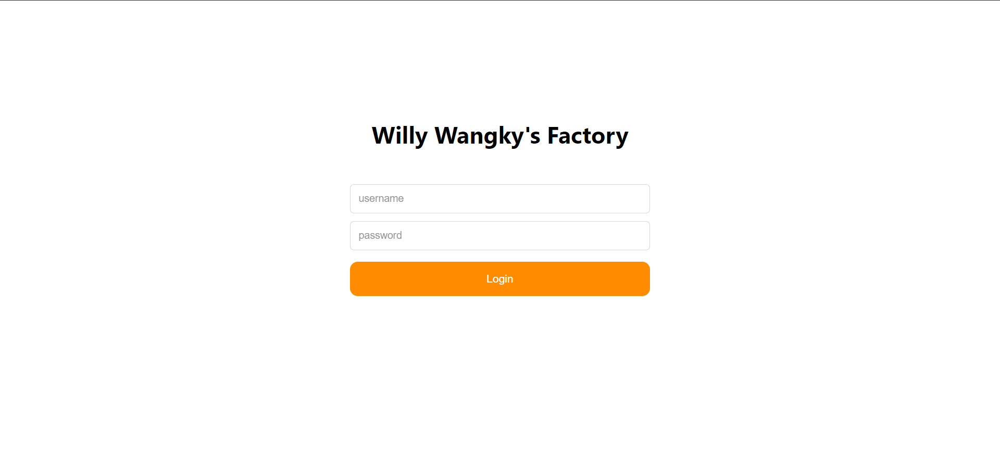
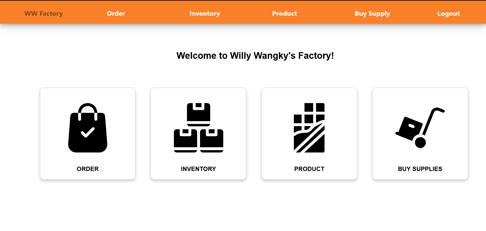
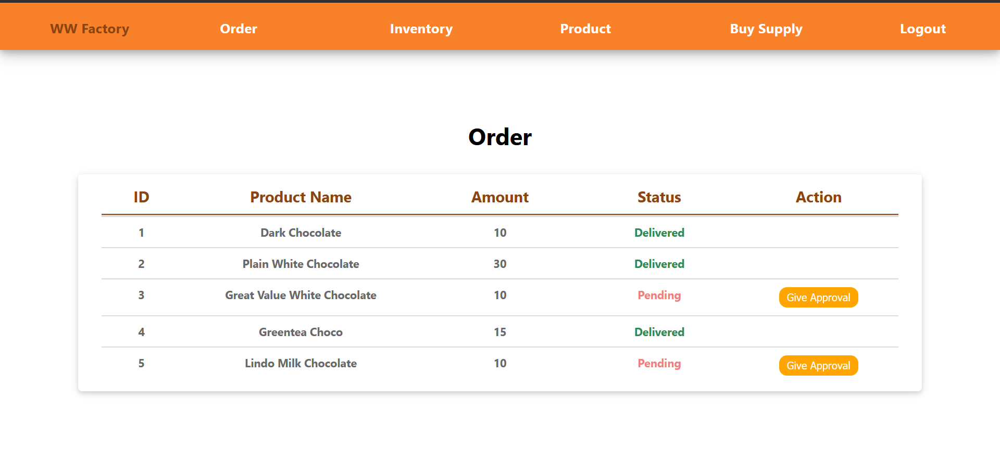
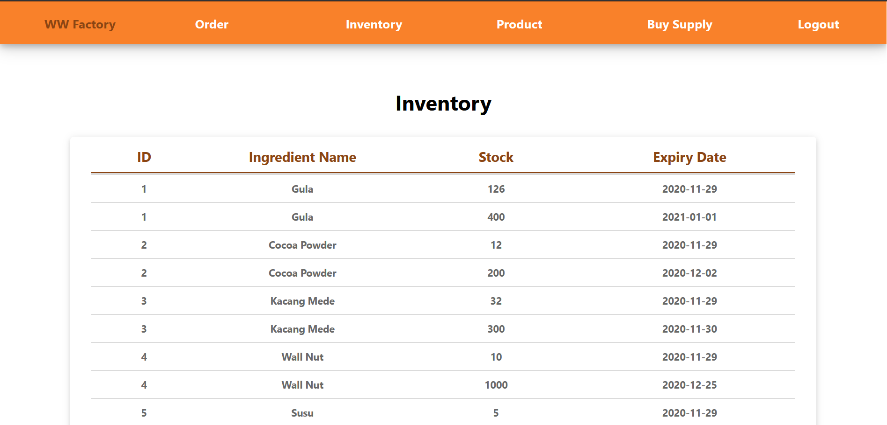
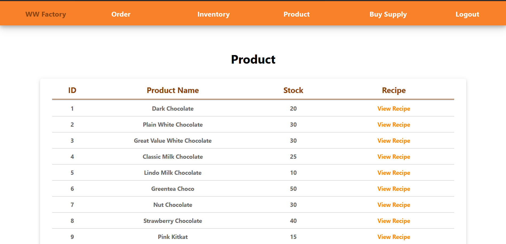

# Tugas Besar 2 IF3110 Pembelajaran Aplikasi Berbasis Web
# Willy Wangky's Factory

## Deskripsi Aplikasi
Aplikasi Willy Wangky's Factory menyediakan antarmuka untuk mengatur segala operasi yang berkaitan dengan pabrik. Aplikasi ini dibangun dengan ReactJs. Untuk mengakses aplikasi ini, perlu melakukan login untuk mengakses semua fitur yang tersedia. Setelah penggunaan selesai, pengguna dapat melakukan logout.

Operasi yang disediakan:
1. Memberikan approval terhadap pesanan coklat dari WWWeb. Ketika pesanan diberikan approval, maka status pesanan akan diubah dari pending menjadi delivered.
2. Melihat daftar pemesanan coklat dari WWWeb.
3. Melihat daftar bahan yang tersedia di pabrik.
4. Melihat daftar harga bahan yang tersedia di supplier.
5. Membeli bahan dari supplier.
6. Melihat daftar resep coklat.
7. Melihat daftar coklat yang tersedia di pabrik.
8. Melihat saldo pabrik.

## Screenshot Aplikasi
### Halaman Login

### Halaman Home

### Halaman Order

### Halaman Inventory

### Halaman Product
